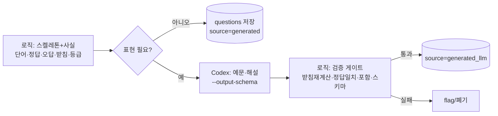

# korean_helper — 문제 생성 설계

> reps 엔진의 "문제 재료"를 어떻게 만드는가. 실측 검증(2026-08-09) 반영.
> 관련: [`data_model.md`](./data_model.md)(questions 스키마) · [`contexts/local_llm_context.md`] · [`contexts/codex_context.md`] · [`contexts/vector_db_context.md`]

## 0. 핵심 원칙

- **로직이 사실을 전담** — 받침·조사·정답·오답후보·등급필터·채점. 무료·즉시·**보장(100%)**.
- **LLM은 표현만** — 로직이 못 하는 자연 예문·뉘앙스·해설. **오프라인 + 검증 게이트**. 사실을 *묻지* 않고, 로직이 준 사실로 표현만 시킨다.
- **벡터는 오프라인 precompute** — prod(t4g.small, GPU 없음)는 결과 테이블만 조회.
- **근거(실측)**: 받침 판정 — 로컬 9B **65%**(띵크ON은 무한루프), gpt-5.6-luna **100%**, 우리 로직 **100%**. luna가 맞혀도 **비용·보장** 때문에 사실은 로직. → LLM에 사실 위임 금지.

## 1. 문제 트랙

| 트랙 | 내용 | 엔진 |
|---|---|---|
| **A. 어휘** | 단어↔뜻, 한자↔단어 | 순수 로직 (MVP 본체) |
| **B. 문법** | 받침 기반 조사 *형태*(이/가) | 로직 |
| | 의미 선택(은/는 vs 이/가 왜?)·활용·시제 | 저작 or LLM초안+검수 |

## 2. 입력 방식 — 듀얼 (탭 + 직접 입력)

우리가 정답·선택지를 생성하므로 **같은 문제에 두 모드를 다 제공**하고 유저가 고른다.

- **탭 선택**: 인식(recognition), 쉬움·빠름 — 채점 자명
- **직접 입력**: 회상(recall), 기억에 강함 — 정답을 알고 있으니 대조 채점
- **입력 채점 공정성**: 정답 하나가 아니라 **정답 세트**(같은 뜻 공유 단어들, 데이터에서 로직 생성) + 정규화(공백·동음이의어번호·전각/반각)로 대조. → 동의어 오判 방지.
- **방향별**: `뜻→단어`·`단어→한자`는 입력 OK(정답이 한국어/한자). `단어→뜻`(일본어 자유서술)은 채점 지저분 → **탭 위주**.
- **사용 가이드**(온보딩, Japanese-first 톤): 탭=빠름·복습·저부하 / 입력=고부하·**기억 정착 강함**. 「しっかり覚えたい時は入力、さっと復習は選択」.

## 3. 오답(distractor) 전략 — 3축 + 가드

랜덤 오답은 무관한 보기가 껴서 **소거법**으로 풀림. 아래 3축을 섞으면 모든 보기가 그럴듯 → 소거 차단.

| 축 | 도구 | 커버 |
|---|---|---|
| 형태 헷갈림 (가게/가격) | 로직 — 편집거리 | 전체 |
| 의미 헷갈림 — 한자어 (약속→예약) | 로직 — 한자 공유 | 한자 보유 60%+ |
| 의미 헷갈림 — 고유어 (가게→편의점) | **벡터** (§4) | 나머지 ~40% |

**가드 (공정성 — 과유사 = 준동의어/하위어 방지):**
1. **ja 겹침 제외** — 뜻이 겹치면 실은 정답. 컷.
2. **부분문자열 제외**(로직) — 후보가 정답을 포함/피포함하면 컷. 예: 바지 ⊂ **청바지·반바지**(하위어) 즉시 제거.
3. **유사도 상한**(벡터) — 의미유사도 너무 높은(>~0.75) 준동의어 컷. **중간 밴드**만 오답.

**보너스 — 유사도 밴드 = 난이도 손잡이:** 가까운 밴드(0.6~0.75)=어려움 / 먼 밴드(0.4~0.55)=쉬움. ★☆☆~★★★를 유사도로 자동 조절.

## 4. 벡터 레시피 (고유어 의미오답)

- **임베딩 대상 = "단어 + 길잡이말"** (한국어 맥락). 실측: 단어만은 형태충돌(바지→바다) 실패, **일본어 뜻 임베딩은 かな 표면형으로 뭉쳐 쓰레기**, 단어+길잡이말이 실패 케이스 방어(바지→반바지·청바지·수영복·옷).
- **오프라인 precompute**: 임베더(Qwen3-Embedding-0.6B, `vector_db_context.md`)로 어휘 임베딩 → 단어별 top-k 이웃 → **Postgres 이웃 테이블** 저장.
- prod 런타임에 벡터엔진·GPU 없음. Qdrant/임베더는 **개발 때만**.
- 부수효과: 이 임베딩 인프라는 후속 "자유서술 뜻 채점"·"문법포인트 의미검색"에도 재활용.

## 5. LLM 보조 (Phase 1+)

- 엔진: **Codex(gpt-5.6-luna)** 우선(품질), `--output-schema`로 JSON 강제. 비용 민감 시 로컬 9B 초안.
- 용도: 로직 스켈레톤에 **자연 예문·일본어 대조 해설** 붙이기. **사실 판정 위임 금지.**
- **검증 게이트(로직)**: 받침 재계산 일치? 단어가 문장에 포함? 정답이 로직과 일치? 스키마·중복 OK? → 통과분만 저장, 실패는 flag.

## 6. 파이프라인

## 7. 순서 (Phase)

1. **Phase 0 (지금)** — 로직 MCQ 생성기 `gen_questions.py`: 단어↔뜻·한자↔단어, 오답=한자공유+형태유사+랜덤. 등급필터로 초급부터 수천 문항. **학습 루프·SRS 실물 검증용.**
2. **Phase 1** — 벡터 이웃 precompute(고유어 오답 보강) + Codex 예문/해설 살붙이기(검증 게이트).
3. **Phase 2** — 저작 뉘앙스 문법문제, 클로즈 주관식(문맥→유일정답), 자유서술 벡터 채점.

## 8. 남은 검토/튜닝 (→ todo)

- **스키마 보정**: `questions.episode_id`를 nullable로 + `vocab_id` 추가 (어휘문제=vocab연결 / 문법문제=EP연결). 마이그레이션 미적용이라 지금 고치면 깔끔.
- 오답 임베딩 전략 최종화: 단어+길잡이말 vs 앙상블(word ∪ word+guide), 유사도 밴드 임계값 튜닝.
- 정답 세트(입력 채점용) 생성 로직 — 뜻 공유 그룹핑 커버리지.
- 클로즈 주관식 캐리어 문장 = 소프트 레이어(Codex+검증).
